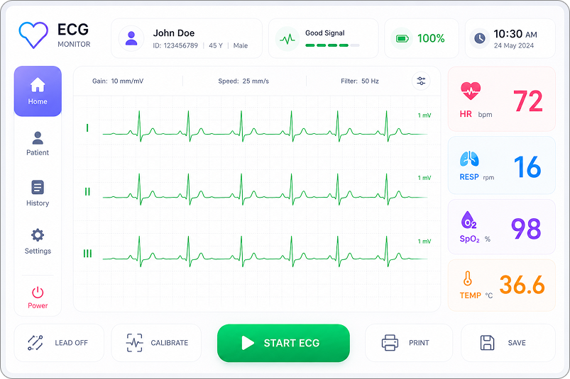

  <a href="https://lvgl.io/safe" title="LVGL Safe homepage">Website</a> |
  <a href="https://github.com/lvgl/lvgl" title="The open-source LVGL library">LVGL Open</a> |
  <a href="https://github.com/lvgl/lvgl_pro" title="The professional toolkit">LVGL Pro</a> |
  <a href="https://lvgl.io/safe#contact" title="Talk to us about your needs in functional-safety">Contact</a>

 

  

<h1 align="center">LVGL Safe</h1>

  LVGL Safe is a certification-ready UI Library for safety-critical products.
  It ships with the documentation and verification evidence that feeds directly into your
  product's own certification process, across four target industries: 
  <b>Automotive</b>, <b>Medical</b>, <b>Industrial</b>, and <b>Avionics</b>.

 

  

 

  <a href="#overview" title="What LVGL Safe is">Overview</a> •
  <a href="#lvgl-safe-vs-lvgl-open" title="How it relates to open-source LVGL">LVGL Safe vs LVGL Open</a> •
  <a href="#standards" title="Supported standards and levels">Standards</a> •
  <a href="#whats-in-the-delivery" title="Everything you receive">Delivery</a> •
  <a href="#timeline" title="What happens when">Timeline</a> •
  <a href="#getting-started" title="How to start">Getting Started</a> •
  <a href="#get-in-touch" title="Talk to us">Get in Touch</a>

## Overview

- **Built for safety-critical systems**: written from the ground up with safety as the north star.
  Certification-driven development, safety manuals, and zero external dependencies.
- **Certification ready**: compatible with ISO 26262, IEC 62304, IEC 61508, and DO-178C, with the
  artifacts that support your own qualification effort.
- **Small footprint, same performance**: minimal memory usage through functional widgets instead of
  image blending, without giving up the look and responsiveness you expect from LVGL.
- **Accessible source code**: full visibility into the codebase, so you can audit, verify, and trust
  every line before you ship a critical device.
- **Complete delivery**: not a stripped-down variant you have to qualify from scratch, but source,
  documentation, and the evidence trail your auditors will ask for.

## LVGL Safe vs LVGL Open

**LVGL Safe is not a fork of [LVGL Open](https://github.com/lvgl/lvgl).** It is a new library,
written from scratch in C99 with safety as the north star from the first commit. None of the
open-source codebase was carried over, because a certifiable library has to be designed around its
requirements (no runtime allocation, no hidden global state, deterministic rendering, full
requirement-to-test traceability), and those properties cannot be retrofitted onto a
general-purpose GUI engine by trimming it down.

The two libraries share a name, an author, and a design philosophy, but they solve different
problems and make opposite trade-offs. LVGL Open optimizes for features and developer velocity;
LVGL Safe optimizes for predictability, auditability, and evidence.

| Aspect | LVGL Open | LVGL Safe |
|---|---|---|
| **Goal** | Rich, general-purpose GUI | Certifiable, auditable UI for safety-critical products |
| **Source & licensing** | Free and public under MIT | Source available under a commercial agreement, per product |
| **Feature set** | Broad: 30+ widgets, everything a modern UI needs | Deliberately smaller: every feature must be justifiable and verifiable |
| **Reliability** | Community-tested, production-proven | Highest priority: MISRA C:2012, deterministic behavior, 100% test coverage, full traceability |
| **Memory** | Dynamic allocation at runtime | No runtime allocation; the caller owns every struct and buffer |
| **Object lifecycle** | Widgets created and deleted freely | Create only: widgets live for the lifetime of the program |
| **Global state** | Global/default display and registries | No internal global or static state |
| **Styling & layout** | Cascading styles, themes, flex and grid | Explicit per-widget fields, per-state colors, absolute positioning |
| **Rendering** | Multiple draw units, GPU and HW acceleration | One deterministic software renderer |
| **Dependencies** | Optional integrations (filesystems, decoders, libraries) | C99 and the standard library only |
| **Portability** | Fully portable to any MCU/MPU and any (RT)OS | Fully portable to any MCU/MPU and any (RT)OS |
| **Documentation** | Docs and examples | Docs plus safety manual, verification report, traceability, SBOM |
| **Tooling** | LVGL Pro Editor | LVGL Pro Editor |

**What LVGL Safe gives you today:** a software renderer writing into a framebuffer you own;
multiple displays and screens; rectangle, label, button, image, image button, and arc widgets;
pointer and touch input with press, pressing, and click events plus index-based focus handling;
multi-language translations and value binding on labels; image rotation and perspective transforms;
offline image and font converters, so nothing is decoded at runtime; and a screenshot-based
regression test framework. Everything is selected at compile time in a single `ls_conf.h`, and
every public function returns an explicit error code.

If you need a full-featured GUI for a general-purpose product, use LVGL Open. It stays free, open,
and actively developed. Choose LVGL Safe when your product has to be certified, and when
predictable, allocation-free, reviewable code matters more than breadth of features.

## Standards

| Industry   | Standard   | Supported up to |
|------------|------------|-----------------|
| Automotive | ISO 26262  | ASIL B          |
| Medical    | IEC 62304  | Class B         |
| Industrial | IEC 61508  | SIL 2           |
| Avionics   | DO-178C    | DAL C           |

## What's in the Delivery

### Product & compliance documentation

| Document | What it gives you |
|---|---|
| **Datasheet** | High-level technical overview of LVGL Safe: supported standards, configurations, resource footprint, and performance characteristics. The at-a-glance summary an evaluator reads first. |
| **Integration manual** | Step-by-step guidance for bringing LVGL Safe into a target system: porting, configuration, build setup, and the interfaces the integrator is responsible for. |
| **Safety manual** | The core safety document. Defines the assumptions of use, safety-related constraints, and the conditions under which LVGL Safe's safety claims hold. |
| **API reference** | Complete specification of every public function: parameters, return values, expected behavior, and any safety-relevant usage notes. |
| **Verification report** | Evidence that the software was tested against its requirements: test cases, results, and coverage data. |
| **Traceability summary** | A mapping from requirements through design to tests, showing each requirement is implemented and verified with no gaps. A key artifact auditors look for. |

### Delivery & support documentation

| Document | What it gives you |
|---|---|
| **Release notes** | What this specific release contains: changes, fixes, and known limitations, so you can assess impact and qualify the exact version you ship. |
| **License & notices** | The licensing terms for LVGL Safe and a record of any third-party components included, along with their respective licenses and obligations. |
| **SBOM** | A complete inventory of components, versions, and dependencies in the delivery, supporting supply-chain transparency and security review. |
| **Security policy** | How vulnerabilities are reported, triaged, and patched, and the maintenance commitment over the product's deployed lifetime. |
| **Delivery manifest** | An itemized list of everything in the delivery, with checksums and signatures confirming the artifacts received are exactly what LVGL shipped. |
| **Support & warranty** | The support scope, response expectations, and warranty conditions that apply to LVGL Safe. |

## Timeline

| When | What happens |
|---|---|
| **July 2026** | Early Access opens. |
| **August 2026** | Source code preview: priority access ahead of GA. |
| **October 2026** | Early Access closes: last date to reserve a slot. |
| **December 2026** | Full delivery: docs, artifacts, evidence. Start building. |

## Getting Started

The quickest way to see what the preview can do is to build the two example apps in
[examples/](/examples/). They run on your desktop in an SDL2 window, so no target
hardware is needed. Three guides cover the basics of using the LVGL Safe preview:

| Document | Read it for |
|---|---|
| [Examples Guide](/docs/examples-guide.mdx) | Building and running the two example apps, and converting your own images and fonts |
| [General Guide](/docs/general-guide.mdx) | What the library is and how displays, screens and widgets fit together: the concepts behind the API |
| [API reference](/docs/api-reference.mdx) | The field-by-field reference for every type and widget, with a copy-pasteable snippet for each |

## Get in Touch

Building a safety-critical product and wondering how LVGL Safe fits into it? Talk to us.

**[Contact us](https://lvgl.io/safe#contact)** or email [lvgl@lvgl.io](mailto:lvgl@lvgl.io).
Tell us your target standard, certification level, and timeline, and we will walk you through the
delivery and reserve your Early Access slot.
